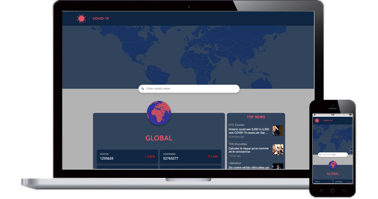

<p align="center">
  
  <h3 align="center">Covid19 - tracker</h3>
  <p align="center">
    <a href="https://adi52.github.io/covid-tracker-webpage/dist/index.html"><strong>View a Demo »</strong></a>
  </p>
</p>


## Table of contents
* [General info](#general-info)
* [Availability](#availability)
* [Technologies](#technologies)
* [API](#api)
* [Setup](#setup)
* [Status](#status)
* [Inspiration](#inspiration)
* [Screenshots](#screenshots)
* [Contact](#contact)

## General info

Do you want know how much cases of covid19 is now in all World, or your Country? You can see it in my website!

On this website, you can see the world map first. And below it, data such as deaths, confirmed, active, recovered a chart with the daily increase in infected and the latest news from the world on covid19.

You can choose the country you are interested in, on the map. Another way to choose a target is to use an intelligent search engine that will show you all the possibilities.

Then the tiles and news are updated.

## Availability :computer:
Webpage is full responsive. You can see clearly data in any device.

<p align="center">
  
</p>

## Technologies 
- HTML 5
- JavaScript ES6
- Sass 1.29
- amCharts 4
- chart.js 2.0
- FontAwesome 5
- Webpack 5.4

## API :cloud:
In this app I use this API:
- https://about-corona.net/
- https://gnews.io/
- https://restcountries.eu/

Thanks! You did a great job! :coffee:

## Setup :dvd:

> Live version: [click »](https://adi52.github.io/covid-tracker-webpage/dist/index.html)

Clone repo: 
```
$ git clone https://github.com/Adi52/covid-tracker-webpage.git 
$ npm install 
$ npm run dev
```
Type in the browser:  

`http://localhost:8001`

## Status
Project is: `finished`. I don’t plan to expand this, only a fix for bugs found.


## Inspiration
I wanted to make this type of website because I wanted to apply all the knowledge I had gained in the last six months in one project. Things like **BEM methodology**, **Webpack**, **npm**, **es modules**, **node.js**, **fetch API**, **SASS preprocessor**, **responsiveness**, **accessibility**, **flexbox**, **SVG** are used here.

## Screenshots

<p align="center">
  
</p>

## Contact :envelope:
Created by [bielinski.dev](https://github.com/adi52) - feel free to contact me!